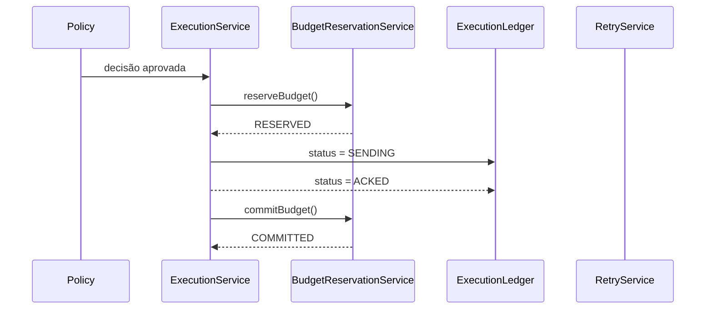
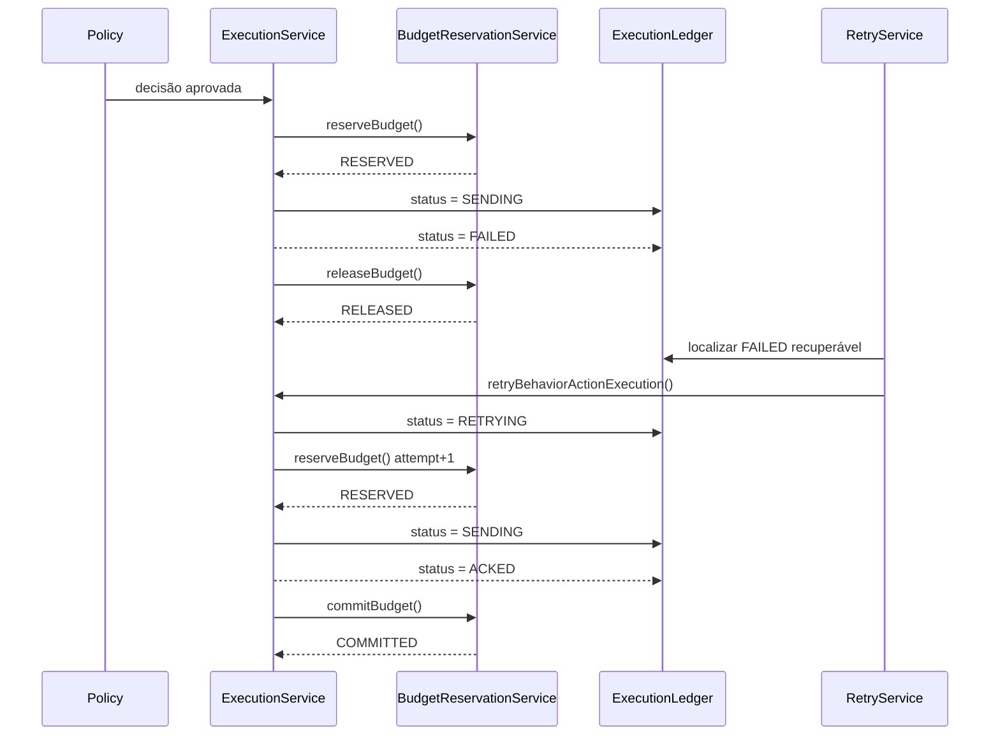

# Diagramas — Fase 1

## Happy path

```mermaid
sequenceDiagram
    participant P as Policy
    participant E as ExecutionService
    participant B as BudgetReservationService
    participant L as ExecutionLedger
    participant R as RetryService

    P->>E: decisão aprovada
    E->>B: reserveBudget()
    B-->>E: RESERVED
    E->>L: status = SENDING
    E-->>L: status = ACKED
    E->>B: commitBudget()
    B-->>E: COMMITTED
```

## Falha + retry

```mermaid
sequenceDiagram
    participant P as Policy
    participant E as ExecutionService
    participant B as BudgetReservationService
    participant L as ExecutionLedger
    participant R as RetryService

    P->>E: decisão aprovada
    E->>B: reserveBudget()
    B-->>E: RESERVED
    E->>L: status = SENDING
    E-->>L: status = FAILED
    E->>B: releaseBudget()
    B-->>E: RELEASED
    R->>L: localizar FAILED recuperável
    R->>E: retryBehaviorActionExecution()
    E->>L: status = RETRYING
    E->>B: reserveBudget() attempt+1
    B-->>E: RESERVED
    E->>L: status = SENDING
    E-->>L: status = ACKED
    E->>B: commitBudget()
    B-->>E: COMMITTED
```
